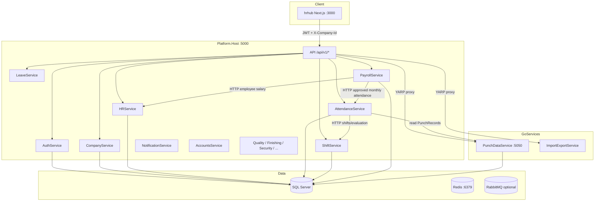
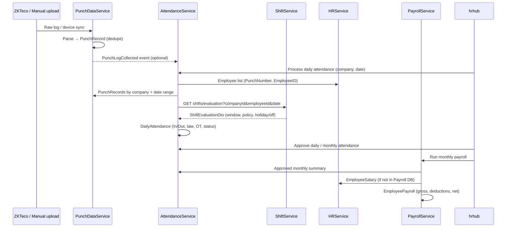
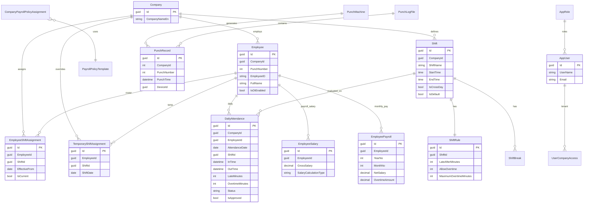
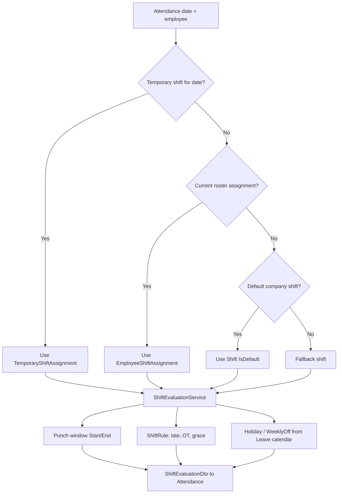
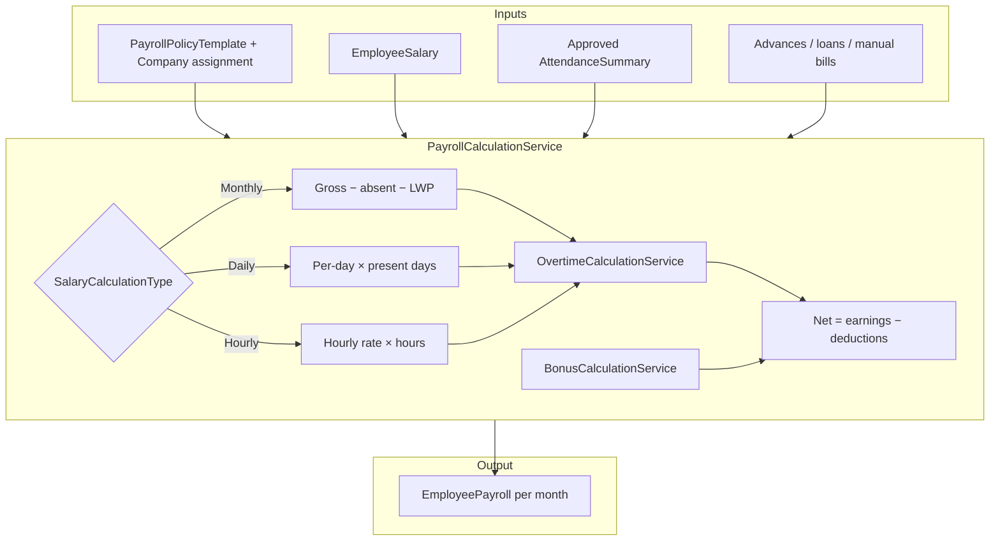
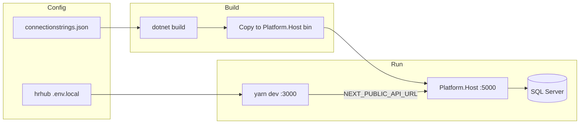

# Enterprise ERP — Architecture, Data Flow & ERD

Downloadable diagram pack for **EnterpriseERP**. Open `.mmd` files in [Mermaid Live Editor](https://mermaid.live) or use `diagrams-viewer.html` in a browser (Print → Save as PDF).

---

## 1. System overview

---

## 2. End-to-end data flow (HR → punch → payroll)

---

## 3. ERD (core HR, attendance, shift, payroll)

---

## 4. Shift selection & evaluation

---

## 5. Daily attendance processing

```mermaid
flowchart LR
    A[Process day API] --> B[Map Company GUID → PunchData CompanyId]
    B --> C[Load employees from HR]
    C --> D[Load punches from PunchData]
    D --> E[For each employee]
    E --> F[Shift evaluation API]
    F --> G[Filter punches in punch window]
    G --> H[AttendanceProcessingService]
    H --> I[Upsert DailyAttendance]
    I --> J[Status: Present / Late / Absent / Holiday]
    J --> K[Approve → IsApproved = true]
    K --> L[Monthly rollup for payroll]
```

---

## 6. Salary calculation

---

## 7. Connection setup flow

---

## Database map

| Service | Database |
|---------|----------|
| Auth | AuthServiceDB |
| Company | CompanyServiceDB |
| HR | HRServiceDB |
| Shift | ShiftServiceDB |
| Attendance | AttendanceServiceDB |
| PunchData | PunchDataDB |
| Payroll | PayrollServiceDB |
| Leave | LeaveServiceDB |

---

## Files in this pack

| File | Description |
|------|-------------|
| `diagrams/01-system-overview.mmd` | Architecture |
| `diagrams/02-data-flow-sequence.mmd` | Punch → payroll sequence |
| `diagrams/03-erd-core.mmd` | Entity relationship |
| `diagrams/04-shift-selection.mmd` | Shift logic |
| `diagrams/05-attendance-process.mmd` | Daily attendance |
| `diagrams/06-salary-calculation.mmd` | Payroll calc |
| `diagrams/07-connection-setup.mmd` | Config & run |
| `diagrams-viewer.html` | Browser viewer + Print to PDF |
