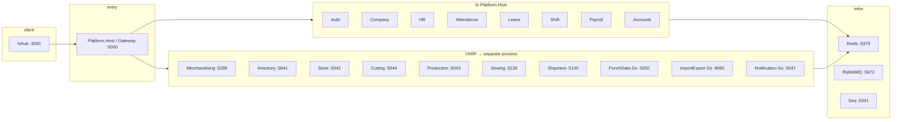

# Enterprise ERP — Build, Run, and Service Management

This guide explains how to **build** the full stack, **run** it locally, and **manage** backend microservices together with the **hrhub** frontend. It is the practical companion to [backend/docs/architecture.md](../backend/docs/architecture.md) and [backend/docs/deployment.md](../backend/docs/deployment.md).

---

## 1. What you are running

Enterprise ERP is a **monorepo**:

| Area | Path | Role |
|------|------|------|
| Web UI | `hrhub/` | Next.js App Router client (port **3000**) |
| Platform | `backend/` | .NET microservices, Go workers, API gateway, Docker infra |

Clients call **one API entry point** on port **5000**. In day-to-day development that is usually **Platform.Host** (auth + HR modules in-process + YARP proxy to satellite services), not a dozen separate terminals.



**Strangler pattern:** New domains live in dedicated services with their own SQL database and EF migrations. Older paths may still route to a legacy monolith (`HrHub_backend`, port **5011**) when using **Gateway.Api** in split-host mode — see [section 6](#6-alternate-run-modes).

---

## 2. Prerequisites

Install before your first build:

| Tool | Version / notes |
|------|-----------------|
| [.NET SDK](https://dotnet.microsoft.com/download) | **10** (services target `net10.0`) |
| [Node.js](https://nodejs.org/) | **18+** (hrhub uses Next.js 16) |
| [Go](https://go.dev/dl/) | **1.22+** (PunchData, ImportExport, Notification) |
| **SQL Server** | Local instance or Docker; one database per service |
| **Docker Desktop** | Optional but recommended for Redis, RabbitMQ, Seq |
| **EF Core tools** | `dotnet tool install --global dotnet-ef` |

On Windows, PowerShell scripts under `backend/Infrastructure/Scripts/` are the fastest way to start the platform.

---

## 3. One-time setup

### 3.1 SQL connection strings

Copy and edit the central config (do **not** commit machine-specific secrets):

```text
backend/Configuration/connectionstrings.json
```

Each service reads this file when `ERP_CONNECTIONSTRINGS` is set (start scripts do this automatically). Point every `*Db` entry at your SQL Server instance and database name.

Example shape (use your server name):

```json
{
  "ConnectionStrings": {
    "AuthDb": "Server=YOUR_INSTANCE;Database=AuthServiceDB;Trusted_Connection=True;...",
    "CompanyDb": "Server=YOUR_INSTANCE;Database=CompanyServiceDB;...",
    "HrDb": "Server=YOUR_INSTANCE;Database=HRServiceDB;...",
    "Redis": "localhost:6379"
  }
}
```

### 3.2 Apply database migrations

From repo root:

```powershell
powershell -File backend/scripts/update-all-databases.ps1
```

This runs `dotnet ef database update` for each .NET service listed in the script (Auth, Company, HR, Attendance, Leave, Shift, Payroll, Accounts, Cutting, Merchandising, Inventory, Store, etc.).

Go services (**PunchData**, **ImportExport**) apply schema on startup (GORM AutoMigrate). **Notification** can auto-migrate when configured.

To **drop and recreate** all dev databases (destructive):

```powershell
powershell -File backend/scripts/reset-all-databases.ps1
```

Edit `$SqlServer` inside that script to match your instance before running.

### 3.3 Platform infrastructure (Redis, messaging, logs)

From `backend/`:

```bash
docker compose up -d redis rabbitmq seq
```

| Service | Port | Purpose |
|---------|------|---------|
| Redis | 6379 | Cache (permissions, merchandising, etc.) |
| RabbitMQ | 5672 (UI **15672**) | Integration events (`erp` / `erp_dev_password`) |
| Seq | **5341** | Structured log viewer |

---

## 4. Full build

### 4.1 Backend (.NET solution)

```powershell
cd backend
dotnet build EnterpriseERP.slnx -c Release
```

Run tests when validating a change:

```powershell
dotnet test EnterpriseERP.slnx -c Release --no-build
```

Build a **single** service:

```powershell
dotnet build Services/MerchandisingService/MerchandisingService.API/MerchandisingService.API.csproj -c Release
```

### 4.2 Go services

Each Go service has its own `go.mod`. First time (example: PunchData):

```powershell
cd backend/Services/PunchDataService
go mod download
go build ./cmd/server
```

Same pattern for `ImportExportService` (`./cmd/api`) and `NotificationService` (`./cmd/server`).

### 4.3 Frontend (hrhub)

```powershell
cd hrhub
npm install
npm run build
```

Development uses `npm run dev` (see [section 5.3](#53-frontend-hrhub)).

---

## 5. Run locally (recommended)

### 5.1 Start everything for typical hrhub work

From repo root (builds solution, starts satellites, then blocks on Platform.Host):

```powershell
powershell -File backend/Infrastructure/Scripts/start-platform.ps1
```

What this script starts:

| Process | Port | Health |
|---------|------|--------|
| ImportExportService (Go) | 8060 | `/health` |
| NotificationService (Go) | 5047 | `/health` |
| MerchandisingService | 5288 | `/health` |
| InventoryService | 5041 | `/health` |
| StoreService | 5042 | `/health` |
| CuttingService | 5044 | `/health` |
| ProductionPlanningService | 5043 | `/health` |
| SewingService | 5130 | `/health` |
| ShipmentService | 5140 | `/health` |
| PunchDataService (Go) | 5050 | `/health` (skip with `-WithoutPunchData`) |
| **Platform.Host** | **5000** | Swagger at `/swagger` |

Options:

```powershell
# Skip rebuild if you already built Release
powershell -File backend/Infrastructure/Scripts/start-platform.ps1 -SkipBuild

# HR-only: no punch/attendance device pipeline
powershell -File backend/Infrastructure/Scripts/start-platform.ps1 -WithoutPunchData
```

**Production-only** satellites (if Platform is already up but production APIs return 502):

```powershell
powershell -File backend/Infrastructure/Scripts/start-production.ps1
```

**Cutting-only** satellites:

```powershell
powershell -File backend/Infrastructure/Scripts/start-cutting.ps1
```

### 5.2 Verify the API

| Check | URL |
|-------|-----|
| Platform Swagger | http://127.0.0.1:5000/swagger |
| Merchandising (direct) | http://127.0.0.1:5288/swagger |
| Punch health (via proxy) | http://127.0.0.1:5000/api/v1/punch-data/health |
| Import health (via proxy) | http://127.0.0.1:5000/api/v1/import-export/health |

Login and HR APIs are served **on the same host** as Platform.Host under `/api/v1/...` (no separate Auth port in this mode).

### 5.3 Frontend (hrhub)

Terminal 2:

```powershell
cd hrhub
npm run dev
```

Open http://localhost:3000.

API base URL (browser):

```env
# hrhub/.env.local (create if needed)
NEXT_PUBLIC_API_URL=http://localhost:5000/api/v1
```

Default in code is already `http://localhost:5000/api/v1` — see `hrhub/lib/api-base.ts`.

Production build:

```powershell
cd hrhub
npm run build
npm run start
```

---

## 6. Alternate run modes

### 6.1 Run Platform.Host only (minimal)

After migrations and Docker infra:

```powershell
cd backend
$env:ERP_CONNECTIONSTRINGS = "$PWD\Configuration\connectionstrings.json"
dotnet run --project Platform.Host/EnterpriseERP.Platform.Host.csproj
```

Proxied routes return **502/503** until the matching satellite is running on the port defined in `Platform.Host/appsettings.json` → `ReverseProxy:Clusters`.

### 6.2 Run one microservice manually

Pattern (Merchandising example):

```powershell
cd backend
$env:ERP_CONNECTIONSTRINGS = "$PWD\Configuration\connectionstrings.json"
dotnet run --project Services/MerchandisingService/MerchandisingService.API/MerchandisingService.API.csproj
```

Default URL from `launchSettings.json`: http://localhost:5288.

Go example (PunchData):

```powershell
cd backend/Services/PunchDataService
$env:ERP_CONNECTIONSTRINGS = "..\..\Configuration\connectionstrings.json"
go run ./cmd/server
```

### 6.3 Split hosts + YARP Gateway.Api (legacy layout)

Documented in [backend/docs/architecture.md](../backend/docs/architecture.md): each domain on its own port (**5012**, **5020**, **5035**, shells **5036–5049**, legacy **5011**), with **Gateway.Api** on **5000** forwarding by path prefix.

```powershell
cd backend
dotnet run --project ApiGateway/Gateway.Api/Gateway.Api.csproj
```

Use this when debugging a **single** extracted service in isolation.

### 6.4 Docker — full gateway stack

From `backend/` (SQL Server must accept TCP from Docker; set `ERP_SQL_SERVER` in `.env` if needed):

```bash
docker compose --profile gateway-docker up -d --build
```

This builds **platform-host**, Go workers, domain containers, and **gateway** exposing **5000**. See `backend/Infrastructure/Docker/docker-compose.platform.yml`.

Infrastructure only (no APIs):

```bash
docker compose up -d redis rabbitmq seq
```

Host-run microservices + gateway in Docker:

```bash
docker compose --profile gateway-host up -d --build gateway-host
```

---

## 7. Service catalog and management

### 7.1 How services are grouped

| Group | How it runs | Management |
|-------|-------------|------------|
| **Core HR platform** | Inside **Platform.Host** (Auth, Company, HR, Attendance, Leave, Shift, Payroll, Accounts, Quality, Finishing, Security) | One process :5000; DB per bounded context |
| **Satellite .NET APIs** | Separate `dotnet run`; YARP on Platform.Host | `start-platform.ps1` or manual; own port + DB |
| **Go workers** | `go run`; proxied under `/api/v1/punch-data`, `/import-export`, `/notification` | Same script; longer startup for PunchData |
| **MicroserviceShells** | Thin placeholders for migration | Optional `dotnet run` per shell; ports 5036–5049 in gateway-host profile |
| **Legacy monolith** | `HrHub_backend` :5011 | Only when using Gateway.Api catch-all |

### 7.2 Ports and API paths (local development)

#### Hosted inside Platform.Host (:5000)

These paths are handled in-process (no extra terminal):

| Domain | Example API prefix |
|--------|-------------------|
| Authentication | `/api/v1/auth/*` |
| Companies / branches | `/api/v1/companies/*`, branches |
| HR | `/api/v1/hr/*` |
| Attendance | `/api/v1/attendance/*` |
| Leave | `/api/v1/leave/*` |
| Shift | `/api/v1/shift/*` |
| Payroll | `/api/v1/payroll/*` |
| Accounts | `/api/v1/accounts/*` |
| Security | `/api/v1/security/*` (SecurityService also has standalone host **5314** if run separately) |

#### Proxied by Platform.Host (must be running)

| Service | Port | API prefix (via :5000) |
|---------|------|-------------------------|
| MerchandisingService | 5288 | `/api/v1/merchandising/*` |
| ProcurementService | 5060 | `/api/v1/procurement/*` |
| InventoryService | 5041 | `/api/v1/inventory/*` |
| StoreService | 5042 | `/api/v1/store/*` |
| CuttingService | 5044 | `/api/v1/cutting-*`, fabric issues, bundles, reports |
| ProductionPlanningService | 5043 | `/api/v1/production/*` |
| SewingService | 5130 | `/api/v1/sewing-*`, production-assignments, targets |
| ShipmentService | 5140 | `/api/v1/shipments/*` |
| PunchDataService (Go) | 5050 | `/api/v1/punch-data/*` |
| ImportExportService (Go) | 8060 | `/api/v1/import-export/*` |
| NotificationService (Go) | 5047 | `/api/v1/notification/*` |

#### Standalone .NET services (optional separate hosts)

| Service | Default port | Notes |
|---------|--------------|-------|
| AuthService.Api | 5012 | Used when not using Platform.Host auth |
| CompanyService.Api | 5020 | |
| HRService.Api | 5035 | |
| AttendanceService.Api | 5010 | |
| ShiftService.Api | 5005 | |
| AccountsService.API | 5229 | Also in Platform.Host |
| SecurityService.API | 5314 | |
| ReportService | (see project README) | |

### 7.3 Which UI needs which backend

| hrhub area | Minimum backend |
|------------|-----------------|
| Login, company, HR, leave, shift, payroll | Platform.Host :5000 |
| Employee Excel import | Platform.Host + ImportExport :8060 |
| Attendance / punch devices | + PunchData :5050 |
| Merchandising | + Merchandising :5288 |
| Store / inventory | + Inventory :5041, Store :5042 |
| Cutting | + Cutting :5044 |
| Production / sewing / shipment | + Planning :5043, Sewing :5130, Shipment :5140 |

### 7.4 Operational commands

| Task | Command |
|------|---------|
| Apply all EF migrations | `backend/scripts/update-all-databases.ps1` |
| Reset dev DBs (destructive) | `backend/scripts/reset-all-databases.ps1` |
| Reset HR/attendance/punch subset | `backend/scripts/reset-hr-attendance-punch-leave-payroll.ps1` |
| Build entire backend | `dotnet build backend/EnterpriseERP.slnx` |
| Start standard dev stack | `backend/Infrastructure/Scripts/start-platform.ps1` |
| Stop process on port 5000 | Kill PID from `Get-NetTCPConnection -LocalPort 5000` (Windows) |

### 7.5 Configuration and secrets

| Setting | Location |
|---------|----------|
| SQL connection strings | `backend/Configuration/connectionstrings.json` |
| JWT (dev) | `Platform.Host/appsettings.json` → `Jwt:SigningKey` (must match across services) |
| YARP upstream URLs | `Platform.Host/appsettings.json` → `ReverseProxy:Clusters` |
| CORS for hrhub | `Platform.Host/appsettings.json` → `Cors:AllowedOrigins` |
| Docker overrides | `Platform.Host/appsettings.Docker.json`, compose env vars |

For production, replace signing keys, use a secret store, TLS at the load balancer, and SQL users with least privilege per database.

---

## 8. How services work together

1. **Authentication:** Platform.Host issues JWTs (Auth module). Every API validates issuer, audience, and signing key.
2. **Multi-tenancy:** Company/branch context via headers and claims (`Security:EnforceTenant` in config).
3. **Synchronous calls:** HTTP between services (e.g. Store → Inventory, Sewing → Merchandising) using `Services:*` or `ExternalServices` URLs in `appsettings`.
4. **Async integration:** RabbitMQ exchange `erp.events` (and payroll-specific exchange); event type constants in `Erp.BuildingBlocks.EventBus`.
5. **Caching:** Redis for read-heavy, slow-changing data; invalidate on writes in each service.
6. **Import/export:** Large Excel jobs go to ImportExport (Go) on :8060; HR reads/writes via Platform.Host HR APIs.
7. **Observability:** Serilog → console; optional Seq on :5341; use gateway trace/correlation IDs in logs.

Each microservice follows **Clean Architecture**: `{Service}.API` → Application → Domain; Infrastructure implements persistence. See [backend/docs/architecture.md](../backend/docs/architecture.md).

---

## 9. Troubleshooting

| Symptom | Likely cause | Action |
|---------|--------------|--------|
| **502** on merchandising/cutting/production | Satellite not running | Run `start-platform.ps1` or the domain-specific start script |
| **503** on import-export | ImportExport not up on 8060 | Check Go terminal; `/health` on :8060 |
| Login works, tables empty | Migrations not applied | `update-all-databases.ps1` |
| SQL connection errors | Wrong server in `connectionstrings.json` | Fix `Server=`; ensure SQL TCP enabled |
| Port already in use | Previous run still bound | Stop PID on that port; scripts try to free 5000/5050/8060 |
| hrhub CORS errors | Origin not allowed | Add `http://localhost:3000` under `Cors:AllowedOrigins` |
| JWT invalid on satellite | Key mismatch | Align `Jwt:SigningKey` with Platform.Host |

Health endpoints: most .NET APIs expose `/health`; Go services expose `/health` on their direct port.

---

## 10. Related documentation

| Document | Topic |
|----------|--------|
| [README.md](../README.md) | Repo overview |
| [backend/README.md](../backend/README.md) | Backend layout |
| [backend/docs/architecture.md](../backend/docs/architecture.md) | Routing, events, strangler pattern |
| [backend/docs/deployment.md](../backend/docs/deployment.md) | Deployment and gateway-docker |
| [backend/Infrastructure/Docker/docker-compose.platform.yml](../backend/Infrastructure/Docker/docker-compose.platform.yml) | Container topology |
| Service READMEs | `backend/Services/*/README.md` (Merchandising, Cutting, Payroll, PunchData, …) |
| [hrhub/lib/api-base.ts](../hrhub/lib/api-base.ts) | Frontend API URL configuration |
| [hr-domain-architecture.md](hr-domain-architecture.md) | HR, PunchData, Attendance, Leave, Payroll, ImportExport — ERD & data flow |

---

## 11. Quick reference — daily dev workflow

```powershell
# 1. Infra
cd backend
docker compose up -d redis rabbitmq seq

# 2. DB (after clone or schema change)
cd ..
powershell -File backend/scripts/update-all-databases.ps1

# 3. Backend + satellites
powershell -File backend/Infrastructure/Scripts/start-platform.ps1

# 4. Frontend (new terminal)
cd hrhub
npm run dev
```

Browser: http://localhost:3000 → API http://localhost:5000/api/v1.
