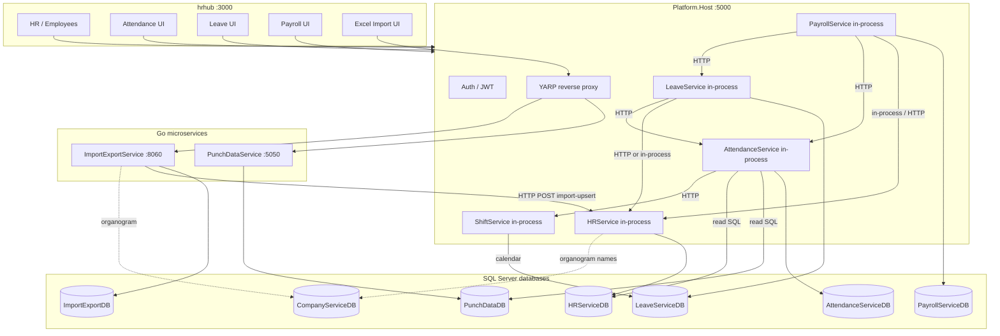
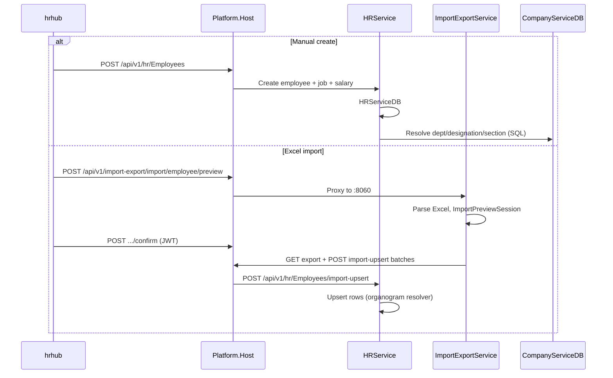
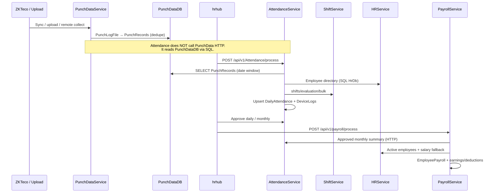
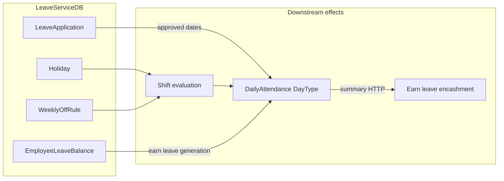
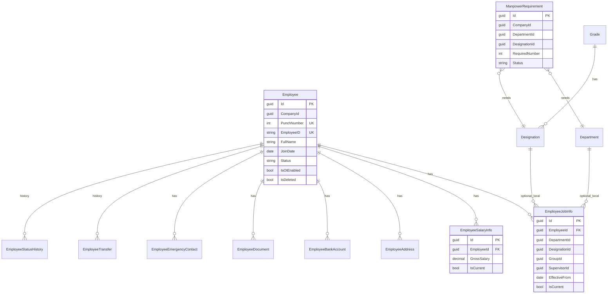
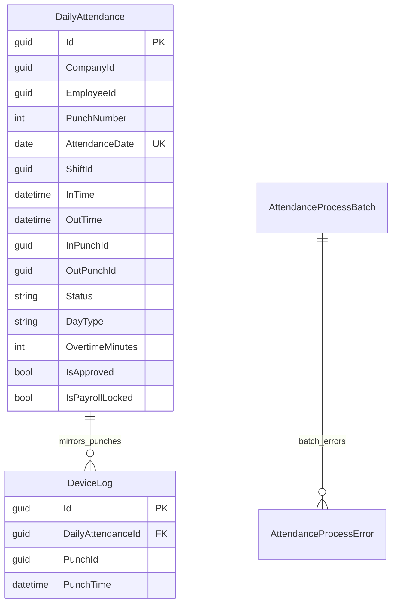
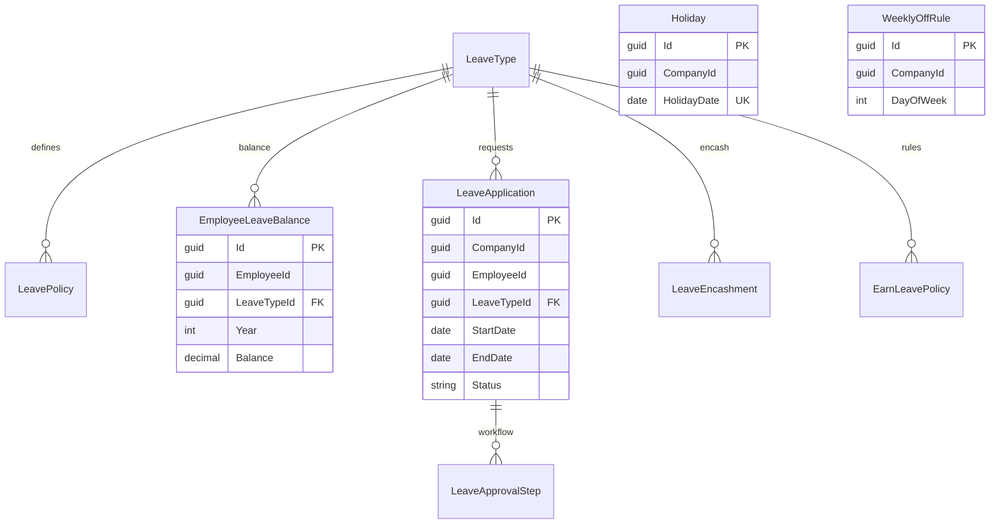
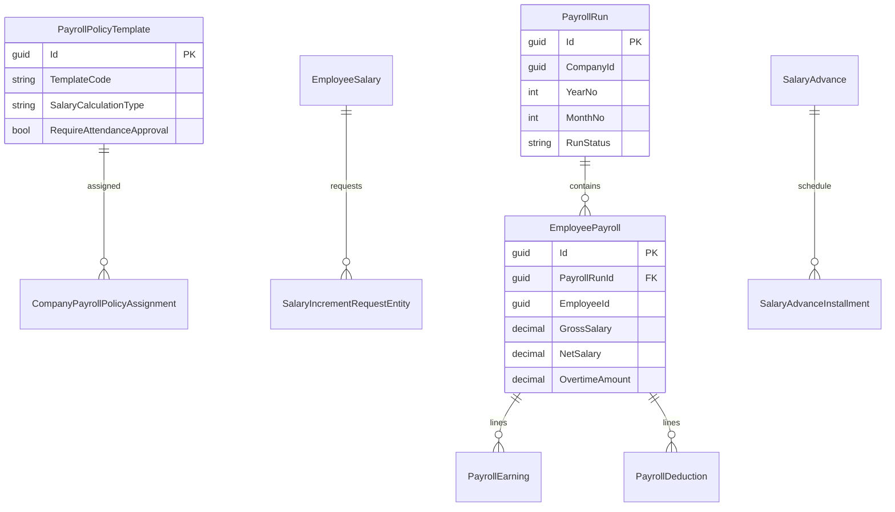
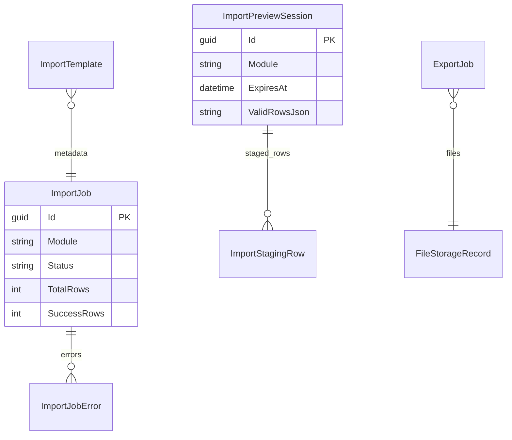
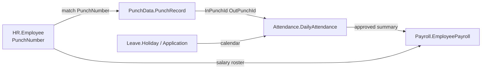

# HR Domain — Architecture, Data Flow, ERD, and Change Guide

This document explains how **HR**, **PunchData**, **Attendance**, **Leave**, **Payroll**, and **ImportExport** work together in Enterprise ERP: data flow, databases, folder layout, and where to change behavior.

**Related docs**

| Doc | Topic |
|-----|--------|
| [build-run-and-services.md](build-run-and-services.md) | Ports, scripts, Platform.Host |
| [hr-hub-hr-service-api-map.md](hr-hub-hr-service-api-map.md) | hrhub ↔ HR REST routes |
| [backend/docs/diagrams/](../backend/docs/diagrams/) | Mermaid sources (`02`–`06`) |
| [attendance-holiday-workflow.md](attendance-holiday-workflow.md) | Holidays / weekly off |

**Runtime note:** In local dev, **Platform.Host** (`:5000`) hosts HR, Attendance, Leave, Payroll, and Shift **in one process**. PunchData and ImportExport run as **separate Go processes** and are reached via YARP proxy. Each bounded context still has its **own SQL database**.

---

## 1. System overview



### Responsibility matrix

| Service | Language | Database | Primary responsibility |
|---------|----------|------------|------------------------|
| **HRService** | .NET | `HRServiceDB` | Employee master, job/salary, transfers, manpower, HR reports |
| **PunchDataService** | Go | `PunchDataDB` | Device/upload/remote ingest → normalized `PunchRecords` |
| **AttendanceService** | .NET | `AttendanceServiceDB` | Daily attendance from punches + shift rules; approval & payroll lock |
| **LeaveService** | .NET | `LeaveServiceDB` | Leave types, balances, applications, holidays, weekly off, earn leave |
| **PayrollService** | .NET | `PayrollServiceDB` | Monthly payroll run, policies, advances, settlements |
| **ImportExportService** | Go | `ImportExportDB` + `CompanyServiceDB` | Excel preview/confirm, jobs; **employee** apply via HR API |

**ShiftService** is not in your list but is required for attendance day processing (evaluation windows, late/OT rules). It reads **Leave** calendar data (holidays / weekly off).

---

## 2. End-to-end data flow

### 2.1 Employee lifecycle (master data)



**Join key for downstream:** `Employee.PunchNumber` (int) and `Employee.EmployeeID` (string) must stay consistent with punch devices and attendance filters.

### 2.2 Punch → attendance → payroll (month close)



Canonical attendance steps match `backend/docs/diagrams/05-attendance-process.mmd`. Payroll calculation inputs match `06-salary-calculation.mmd`.

### 2.3 Leave interactions



- **Shift** uses holidays/weekly off from **Leave DB** (or in-process `LeaveCalendarProvider` on Platform.Host) when marking a day as Holiday / WeeklyOff.
- **Earn leave** (`LeaveService`) calls **Attendance** HTTP for approved working days in a month.
- **Payroll** may call **Leave** for approved encashment amounts when policy allows.

---

## 3. ERD diagrams (per database)

Logical ERDs below reflect **service-owned tables**. Cross-database links are shown as dashed relationships (no FK across SQL databases).

### 3.1 HRServiceDB



**External (read-only SQL):** `CompanyServiceDB` — `Departments`, `Designations`, `Sections`, `Groups` for organogram resolution (`EmployeeOrganogramResolver`, `EmployeeService`).

**Entity files:** `backend/Services/HRService/HRService.Domain/Entities/*.cs`  
**DbContext:** `HRService.Infrastructure/Persistence/HrDbContext.cs`

---

### 3.2 PunchDataDB

```mermaid
erDiagram
    PunchMachine ||--o{ DeviceSyncHistory : sync_runs
    PunchLogFile ||--o{ PunchRecord : normalizes_to
    PunchImportBatch ||--o{ PunchImportError : errors
    RemoteCollectHistory }o--|| PunchMachine : optional

    PunchLogFile {
        guid Id PK
        int CompanyId
        string Source
        string Status
        string RawPayload
    }

    PunchRecord {
        guid Id PK
        guid LogFileId FK
        int CompanyId
        int PunchNumber
        string DeviceId
        datetime PunchTime UK_composite
    }

    PunchMachine {
        guid Id PK
        string SerialNumber
        string IpAddress
        datetime LastSyncedAt
    }
```

**Dedupe key:** `(CompanyId, PunchNumber, DeviceId, PunchTime)`.

**Models:** `backend/Services/PunchDataService/internal/models/*.go`  
**Migrate:** `internal/db/db.go` (GORM AutoMigrate on startup)

---

### 3.3 AttendanceServiceDB



**Read-only contexts (separate connection strings):**

| Context | Database | Tables read |
|---------|----------|-------------|
| `PunchDataReadDbContext` | `PunchDataDB` | `PunchRecords` |
| `HrReadDbContext` | `HRServiceDB` | `Employees`, job info |

**Link to punches:** `InPunchId` / `OutPunchId` → `PunchRecords.Id` (same GUID as PunchData wrote).

**Entity files:** `AttendanceService.Domain/Entities/`  
**Orchestrator:** `AttendanceService.Infrastructure/Services/DailyAttendanceProcessOrchestrator.cs`

---

### 3.4 LeaveServiceDB



**DbContext:** `LeaveService.Infrastructure/Persistence/LeaveDbContext.cs`

---

### 3.5 PayrollServiceDB



**DbContext:** `PayrollService.Infrastructure/Persistence/PayrollDbContext.cs`  
**Entities:** `PayrollService.Domain/Entities/PayrollEntities.cs`

---

### 3.6 ImportExportDB (+ Company DB)



**Company organogram import/export** uses a second GORM connection to `CompanyServiceDB` (`internal/domain/models/company_organogram.go`).

---

### 3.7 Cross-service link diagram (conceptual)



Full-platform ERD sketch (includes Shift, Auth): `backend/docs/diagrams/03-erd-core.mmd`.

---

## 4. How each service works

### 4.1 HRService

**Purpose:** System of record for people — identity (`PunchNumber`, `EmployeeID`), org placement, compensation snapshot, documents, transfers, manpower planning.

**API prefix:** `/api/v1/hr/...` (plus `/api/v1/dashboard/*` for HR analytics).

**Architecture pattern:** Application **service interfaces** (not MediatR) → Infrastructure implementations → `HrDbContext`.

| Layer | Folder | Role |
|-------|--------|------|
| API | `HRService.Api/Controllers/` | `EmployeesController`, `ManpowerRequirementsController`, `HrReportsExportController`, `DashboardController` |
| Application | `HRService.Application/Employees/`, `Manpower/` | `IEmployeeService`, `IEmployeeReadService`, import contracts, DTOs |
| Domain | `HRService.Domain/Entities/` | 13 entities |
| Infrastructure | `HRService.Infrastructure/Services/` | `EmployeeService`, `EmployeeReadService`, `EmployeeImportService`, organogram resolvers |
| Images | `Platform.Host/Controllers/EmployeeImagesController.cs` | Profile/signature upload (not in HRService.Api) |

**Registration (Platform.Host):** `AddHrInfrastructure()` in `Platform.Host/Program.cs`; migrations on `HrDbContext` at startup.

**Integration:**

- **No RabbitMQ events** from HR today.
- **Leave / Payroll** on Platform.Host use `LeaveInProcessEmployeeClient` / `PayrollInProcessEmployeeClient` (no HTTP loopback).
- **ImportExport** calls `POST /hr/Employees/import-upsert` and `GET /hr/Employees/export`.
- **Notification client** exists (`HrNotificationClient`) but is not wired from employee writes yet.

---

### 4.2 PunchDataService (Go)

**Purpose:** Ingest raw attendance logs from biometric devices, file uploads, or remote ZKTeco SQL; store immutable punch events.

**API prefix:** `/api/v1/punch-data/*` (proxied from Platform.Host → `:5050`).

| Area | Path | Role |
|------|------|------|
| Entry | `cmd/server/main.go` | HTTP server, scheduler, DB migrate |
| HTTP | `internal/router/router.go`, `internal/handlers/` | REST + Swagger |
| Pipeline | `internal/processor/service.go` | `PunchLogFile` Pending → parse → `PunchRecords` |
| Devices | `internal/devices/zkteco/`, `internal/sync/` | LAN sync, background scheduler |
| Remote | `internal/collector/` | Fallback read `RemoteZktecoDb` |
| Events | `internal/events/` | Optional `PunchLogCollected` → RabbitMQ (**Attendance does not consume this yet**) |

**Company ID mapping:** Attendance maps **company GUID** (ERP) → **int CompanyId** (PunchData) via `PunchData:CompanyIdByGuid` in Platform.Host `appsettings.json`.

---

### 4.3 AttendanceService

**Purpose:** Turn punch rows + shift policy into one **DailyAttendance** row per employee per day; support approval and payroll lock.

**Main command:** `POST /api/v1/Attendance/process` → `DailyAttendanceProcessOrchestrator`.

**Processing pipeline:**

1. Resolve punch company id.
2. Load punches from **PunchDataDB** (SQL, ~3-day window for night shifts).
3. Load employees from **HRServiceDB** (SQL).
4. Bulk **shift evaluation** (HTTP to ShiftService).
5. Per employee: filter punches to punch window, compute in/out, late, OT, status.
6. Persist to **AttendanceServiceDB**; skip if `IsApproved` or `IsPayrollLocked`.

**Controllers:** `AttendanceService.Api/Controllers/AttendanceControllers.cs`.

**MediatR:** `AttendanceService.Application` features for process, approve, summary, bills.

---

### 4.4 LeaveService

**Purpose:** Leave policies, employee balances, applications/approvals, company holidays, weekly off, earn-leave generation, encashment, payroll month lock metadata.

**External calls:**

| Client | Config key | Used for |
|--------|------------|----------|
| `EmployeeServiceClient` | `Services:Hr:BaseUrl` | Validate employee, join date, lookups |
| `AttendanceServiceClient` | `Services:Attendance:BaseUrl` | Earn leave working-day counts |
| `PayrollServiceClient` | Payroll gate (stub in places) | Month lock checks |
| `NotificationServiceClient` | Notification URL | Approval emails/in-app |

On **Platform.Host**, HR client is replaced with in-process `LeaveInProcessEmployeeClient`.

**Calendar export to Shift:** `LeaveCalendarProvider` (Platform) or `LeaveDbCalendarProvider` (standalone Shift) — affects attendance **DayType** without Leave calling Attendance on every apply.

---

### 4.5 PayrollService

**Purpose:** Monthly payroll run: load policy template, pull approved attendance, compute earnings/deductions/OT, persist `EmployeePayroll`, publish `PayrollProcessedEvent` (RabbitMQ when enabled).

**Main API:** `POST /api/v1/payroll/process`, `POST /api/v1/payroll/reprocess`.

**Handler:** `PayrollService.Application/Handlers/PayrollHandlers.cs` → `ProcessPayrollHandler`.

**Calculation stack:**

| Component | File |
|-----------|------|
| Policy → settings | `PolicyResolver.cs` |
| Structure split (basic/HRA/…) | `SalaryStructureCalculator.cs` |
| OT / bonus / net | `CalculationServices.cs` |
| External data | `Infrastructure/ExternalServices/ExternalServiceClients.cs` |

**Gates:** `RequireAttendanceApproval` on policy → calls attendance `is-approved` before run.

---

### 4.6 ImportExportService (Go)

**Purpose:** Excel **preview** (validation + session) and **confirm** (import job). Only the **employee** module fully applies data; other modules stage rows for future integration.

**API prefix:** `/api/v1/import-export/*` (proxied; 503 if `:8060` down).

| Module | Confirm behavior |
|--------|------------------|
| `employee` | Calls HR `import-upsert` in parallel batches |
| `attendance`, `payroll`, `shift`, `leave` | Writes `ImportStagingRow` only (no Attendance/Payroll API yet) |

**HR HTTP client:** `internal/services/hrclient/` — `ImportUpsert`, `GetEmployeesExport`.

**Fallback on Platform.Host (not proxied):** organogram and address routes handled by C# controllers under `Platform.Host/ImportExport/` and `ImportExportOrganogramFallbackController`.

---

## 5. Folder and file map (where code lives)

### 5.1 HRService

```
backend/Services/HRService/
├── HRService.Api/
│   ├── Controllers/EmployeesController.cs      ← REST + import-upsert
│   ├── Controllers/ManpowerRequirementsController.cs
│   └── Program.cs                              ← standalone host only
├── HRService.Application/
│   └── Employees/IEmployeeService.cs           ← contracts + DTOs (no Contracts project)
├── HRService.Domain/Entities/                    ← change schema here first
├── HRService.Infrastructure/
│   ├── Persistence/HrDbContext.cs
│   ├── Services/EmployeeService.cs             ← writes
│   ├── Services/EmployeeReadService.cs         ← lists, manpower
│   ├── Services/EmployeeImportService.cs       ← import-upsert logic
│   ├── Services/EmployeeOrganogramResolver.cs
│   └── Migrations/                             ← dotnet ef migrations
└── HRService.Tests/
```

### 5.2 PunchDataService

```
backend/Services/PunchDataService/
├── cmd/server/main.go
├── internal/
│   ├── processor/service.go        ← parsing rules
│   ├── repository/                 ← dedupe inserts
│   ├── handlers/logs.go            ← upload
│   ├── sync/service.go             ← device sync
│   └── models/punch_record.go
└── appsettings.json
```

### 5.3 AttendanceService

```
backend/Services/AttendanceService/
├── AttendanceService.Api/Controllers/AttendanceControllers.cs
├── AttendanceService.Application/Features/       ← MediatR handlers
├── AttendanceService.Domain/Entities/
└── AttendanceService.Infrastructure/
    ├── Services/DailyAttendanceProcessOrchestrator.cs
    ├── Services/AttendanceProcessingService.cs   ← status/OT rules
    ├── Services/PunchRecordReader.cs               ← SQL to PunchDataDB
    └── Persistence/PunchData/, Persistence/HrRead/
```

### 5.4 LeaveService

```
backend/Services/LeaveService/
├── LeaveService.Api/Controllers/
├── LeaveService.Application/Features/            ← MediatR
├── LeaveService.Contracts/
├── LeaveService.Domain/Entities/
└── LeaveService.Infrastructure/
    ├── External/HttpServiceClients.cs
    └── Persistence/LeaveDbContext.cs
```

### 5.5 PayrollService

```
backend/Services/PayrollService/
├── PayrollService.Api/Controllers/PayrollController.cs
├── PayrollService.Application/
│   ├── Handlers/PayrollHandlers.cs
│   ├── CalculationServices.cs
│   └── PolicyResolver.cs
├── PayrollService.Domain/Entities/PayrollEntities.cs
└── PayrollService.Infrastructure/
    ├── Persistence/PayrollDbContext.cs
    └── Persistence/PayrollPolicyTemplateSeed.cs
```

### 5.6 ImportExportService

```
backend/Services/ImportExportService/
├── cmd/api/main.go
├── internal/
│   ├── handlers/import_handler.go
│   ├── handlers/template_handler.go
│   ├── services/importsvc/employee_apply.go
│   ├── services/excel/employee_full_columns.go
│   └── services/hrclient/import.go
└── data/imports/                                 ← runtime uploads
```

### 5.7 Platform.Host (composition root)

```
backend/Platform.Host/
├── Program.cs                                    ← DI for HR/Attendance/Leave/Payroll/Shift
├── appsettings.json                              ← YARP clusters, PunchData company map
├── Integration/LeaveInProcessEmployeeClient.cs
├── Integration/PayrollInProcessEmployeeClient.cs
├── Integration/LeaveCalendarProvider.cs
├── Middleware/ImportExportProxyAvailabilityMiddleware.cs
└── Controllers/EmployeeImagesController.cs
```

### 5.8 Frontend (hrhub)

```
hrhub/
├── lib/services/                                 ← API clients per domain
├── app/(root)/...                                ← pages (attendance, leave, payroll, HR)
└── lib/api-base.ts                               ← NEXT_PUBLIC_API_URL → :5000/api/v1
```

---

## 6. How to change behavior

Use this table to find the **first file to edit** for common changes.

### 6.1 HR / employees

| Change | Where | Also update |
|--------|-------|-------------|
| New employee field | `HRService.Domain/Entities/Employee.cs`, DTOs in Application, `EmployeeService` mapping | EF migration; hrhub forms; ImportExport columns |
| Organogram resolution | `EmployeeOrganogramResolver.cs`, `EmployeeOrganogramLookupCache.cs` | CompanyService schema if master data changes |
| List/filter/pagination | `EmployeeReadService.cs`, `EmployeesController.cs` | hrhub table columns |
| Transfer / status rules | `EmployeeService.cs` | Tests in `EmployeeTransferTests.cs` |
| Excel import (HR-native) | `EmployeeExcelImportService.cs`, controller `excel-import/*` | — |
| Excel import (bulk via ImportExport) | Go: `employee_full_columns.go`, `employee_apply.go`; HR: `EmployeeImportService.cs` | Template download in `template_handler.go` |
| Profile image | `Platform.Host/Controllers/EmployeeImagesController.cs`, `EmployeeImageService.cs` | Upload paths in `appsettings` |

### 6.2 PunchData

| Change | Where | Also update |
|--------|-------|-------------|
| Dedupe rules | `internal/repository/`, `models/punch_record.go` indexes | Attendance punch matching |
| Device protocol | `internal/devices/zkteco/` | Machine config UI / DB |
| Upload format | `internal/handlers/logs.go`, `processor/service.go` | — |
| Company id mapping | `Platform.Host/appsettings.json` → `PunchData:CompanyIdByGuid` | Attendance `PunchCompanyIdResolver` |

### 6.3 Attendance

| Change | Where | Also update |
|--------|-------|-------------|
| Day process algorithm | `DailyAttendanceProcessOrchestrator.cs`, `AttendanceProcessingService.cs` | Diagram `05-attendance-process.mmd` |
| Punch load window | `PunchRecordReader.cs` | Night-shift edge cases |
| Approval / payroll lock | Application feature handlers + `DailyAttendance` entity | Payroll gates |
| Monthly summary for Leave/Payroll | Attendance summary handlers (used by HTTP clients) | `ExternalServiceClients` URL paths |
| New bill type (tiffin/night) | Attendance bill entities + handlers | Payroll allowance bills |

### 6.4 Leave

| Change | Where | Also update |
|--------|-------|-------------|
| Leave type / policy | Domain entities, `LeaveRepositories`, feature handlers | hrhub leave setup |
| Approval workflow | `LeaveApplicationsHandlers.cs`, approval steps entity | Notifications client |
| Holiday / weekly off | Holiday/WeeklyOff handlers | Shift calendar provider |
| Earn leave formula | `OperationalHandlers.cs` (attendance client calls) | — |
| Encashment | Encashment handlers | Payroll `GetApprovedLeaveEncashment` |

### 6.5 Payroll

| Change | Where | Also update |
|--------|-------|-------------|
| OT / absent / LWP math | `CalculationServices.cs`, `OvertimeCalculationService` | `PayrollService.Tests/CalculationTests.cs` |
| Policy template defaults | `PayrollPolicyTemplateSeed.cs`, `PayrollEntities.cs` | Admin API / DB assignment |
| Company policy assignment | `PayrollPolicyAdminController`, DB | — |
| Monthly run steps | `PayrollHandlers.cs` | — |
| Attendance/leave inputs | `ExternalServiceClients.cs` | Attendance/Leave API contracts |
| New earning/deduction line | `PayrollEntities.cs`, calculation + handlers | Payslip UI |

### 6.6 ImportExport

| Change | Where | Also update |
|--------|-------|-------------|
| Employee Excel columns | `excel/employee_full_columns.go`, `employee_full_import.go` | HR `EmployeeImportRowDto` |
| Batch size / parallelism | `importsvc/employee_apply.go` | — |
| New module (real apply) | `importsvc/service.go` + new downstream HTTP client | Not just staging |
| Template download | `templatesvc/template.go`, `template_handler.go` | — |
| Proxy / 503 behavior | `ImportExportProxyAvailabilityMiddleware.cs` | Start script for :8060 |

### 6.7 Database migrations

| Service | Command (from `backend/`) |
|---------|---------------------------|
| HR | `dotnet ef database update --project Services/HRService/HRService.Infrastructure --startup-project Services/HRService/HRService.Api --context HrDbContext` |
| Attendance | `--context AttendanceDbContext` |
| Leave | `--context LeaveDbContext` |
| Payroll | `--context PayrollDbContext` |
| All | `powershell -File scripts/update-all-databases.ps1` |

PunchData / ImportExport: schema via GORM AutoMigrate on service start (see service README).

### 6.8 Safe change checklist

1. **Identify owning database** — do not add cross-DB FKs; use IDs + HTTP/SQL read models.
2. **Keep `PunchNumber` stable** — changing it breaks PunchData history and attendance joins.
3. **Platform.Host** — if you add a new proxied service, update `Platform.Host/appsettings.json` `ReverseProxy` and `start-platform.ps1`.
4. **JWT** — ImportExport → HR calls need the user token on confirm; signing key must match across hosts.
5. **Tests** — HR/Payroll/Attendance have unit tests under `*.Tests/`; run after rule changes.

---

## 7. API quick reference (Platform.Host :5000)

| Domain | Method | Route |
|--------|--------|-------|
| HR | CRUD | `/api/v1/hr/Employees`, `/ManpowerRequirements` |
| HR import | POST | `/api/v1/hr/Employees/import-upsert` |
| Punch | * | `/api/v1/punch-data/*` → :5050 |
| Attendance | POST | `/api/v1/Attendance/process`, `/process/range` |
| Leave | * | `/api/v1/leaves/*` (see Leave controllers) |
| Payroll | POST | `/api/v1/payroll/process` |
| Import | POST | `/api/v1/import-export/import/{module}/preview\|confirm` |

Swagger (aggregated): http://127.0.0.1:5000/swagger

---

## 8. Troubleshooting cross-service issues

| Symptom | Likely cause |
|---------|----------------|
| Attendance process: no punches | PunchData not synced; wrong `CompanyIdByGuid`; `PunchNumber` mismatch |
| All employees Absent | Shift evaluation down; no shift assignment |
| Holiday wrong | Leave holidays not seeded; Shift calendar provider not reading Leave DB |
| Payroll blocked | Attendance month not approved (`RequireAttendanceApproval`) |
| Import 503 | ImportExport not running on 8060 |
| Import duplicates | HR export check vs existing `EmployeeID` / `PunchNumber` |
| Earn leave zero | Attendance summary HTTP path/BaseUrl wrong in standalone Leave host |

---

## 9. Summary

| Step | Owner |
|------|--------|
| Define people | **HRService** (+ Company organogram) |
| Capture raw swipes | **PunchDataService** → `PunchRecords` |
| Compute days | **AttendanceService** (reads Punch + HR DB, calls Shift) |
| Time off & calendar | **LeaveService** (feeds Shift; may read Attendance for earn leave) |
| Pay month | **PayrollService** (reads approved Attendance + HR salary + Leave encashment) |
| Bulk hire Excel | **ImportExportService** → HR `import-upsert` |

For day-to-day commands and ports, see [build-run-and-services.md](build-run-and-services.md).
